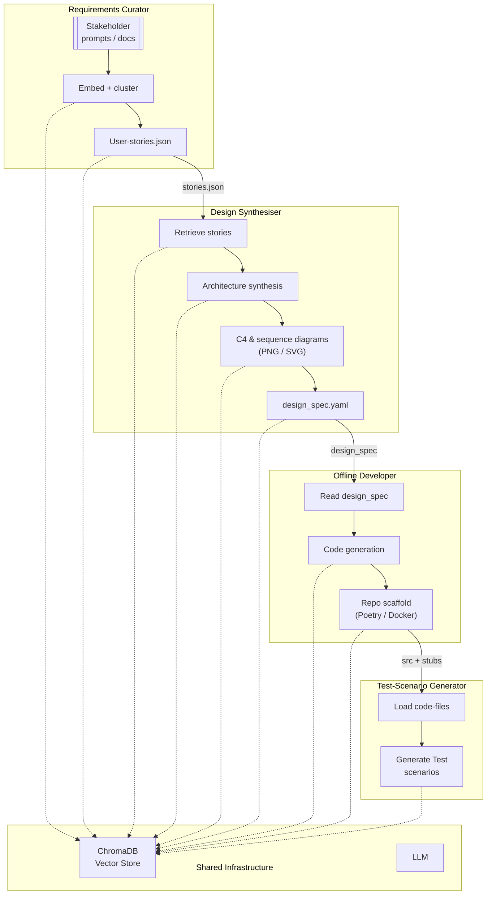

```mermaid
flowchart TD
    %% ============ SHARED INFRASTRUCTURE ============
    subgraph INFRA["<br><br><br>Shared Infrastructure"]
        direction TB
        VECTOR["ChromaDB<br/>Vector Store"]
        BUS["LLM"]
    end

    %% ============ REQUIREMENTS CURATOR ============
    subgraph REQ["Requirements Curator"]
        direction TB
        R0[[Stakeholder<br/>prompts&nbsp;/ docs]]
        R1["Embed + cluster"]
        R2["User-stories.json"]
        R0 --> R1 --> R2
        R1 -.-> VECTOR
        R2 -.-> VECTOR
    end

    %% ============ DESIGN SYNTHESISER ============
    subgraph DSGN["Design Synthesiser"]
        direction TB
        D0["Retrieve stories"]
        D1["Architecture synthesis"]
        D2["C4 & sequence diagrams<br/>(PNG / SVG)"]
        D3["design_spec.yaml"]
        D0 --> D1 --> D2 --> D3
        D0 -.-> VECTOR
        D1 -.-> VECTOR
        D2 -.-> VECTOR
        D3 -.-> VECTOR
    end

    %% ============ OFFLINE DEVELOPER ============
    subgraph DEV["Offline Developer"]
        direction TB
        C0["Read design_spec"]
        C1["Code generation"]
        C2["Repo scaffold<br/>(Poetry / Docker)"]
        C0 --> C1 --> C2
        C1 -.-> VECTOR
        C2 -.-> VECTOR
    end

    %% ============ TEST-SCENARIO GENERATOR ============
    subgraph TSCN["Test-Scenario Generator"]
        direction TB
        T0["Load code-files"]
        T1["Generate Test<br/>scenarios"]
        T0 --> T1 
        T1 -.-> VECTOR
    end

    %% ============ PIPELINE FLOW ============
    R2 -->|"stories.json"| D0
    D3 -->|"design_spec"| C0
    C2 -->|"src + stubs"| T0

    %% ============ STYLING ============
    classDef agent fill:#DDEEFF,stroke:#3355AA,stroke-width:1.5;
    class REQ,DSGN,DEV,TSCN agent

    %% --- sub-graph title colour overrides ---
    style INFRA color:#000
    style REQ   color:#000
    style DSGN  color:#000
    style DEV   color:#000
    style TSCN  color:#000


```